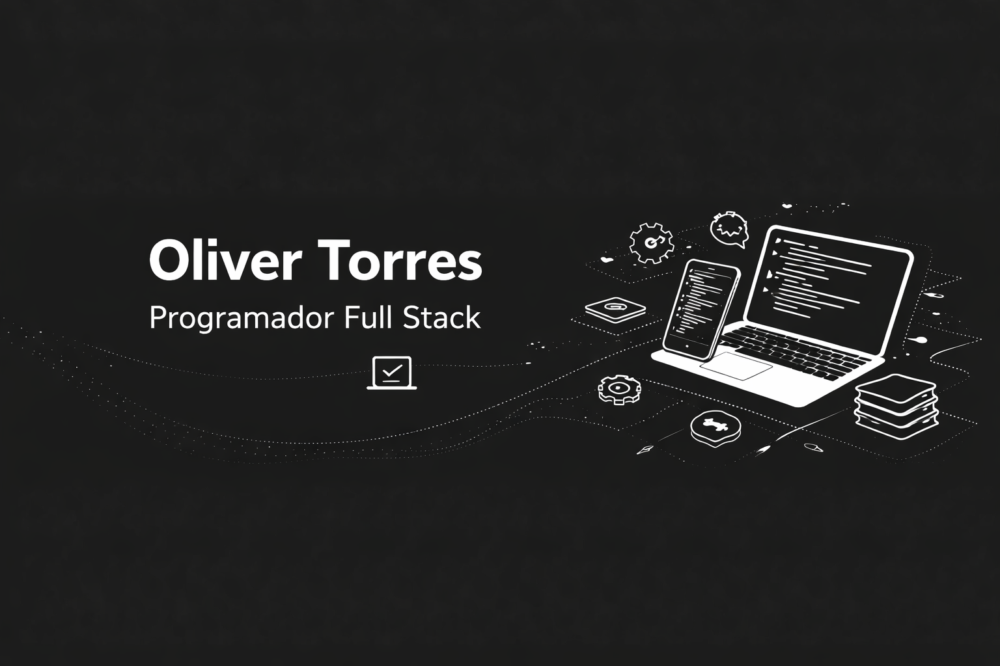

# Hola, soy Oliver 👨‍💻

Desarrollador de Software enfocado en **backend y desarrollo de aplicaciones móviles**, con experiencia construyendo APIs seguras, modelado de bases de datos y despliegue de servicios.

---

## 🚀 Sobre mí

- 📍 Loja, Ecuador  
- 🎓 Tecnólogo en Desarrollo de Software  
- 💡 Enfocado en crear sistemas funcionales, escalables y bien estructurados  
- ⚡ Experiencia en desarrollo backend, mobile y software empresarial  

---

## 🧠 Stack principal

**Backend**
- Node.js + Express
- PostgreSQL
- Prisma ORM
- JWT + Refresh Tokens (manejo de sesiones y autenticación)

**Frontend / Mobile**
- Flutter
- React

**Infraestructura**
- Docker
- Nginx
- Fly.io

**Otros**
- Firebase
- TensorFlow (AI básica)

---

## 🛠️ Experiencia técnica

- 🔐 Implementación de sistemas de autenticación:
  - Access + Refresh tokens
  - Verificación de email
  - Login social
  - Manejo de sesiones persistentes

- 🧱 Arquitectura backend:
  - Estructura por capas: `routes → controllers → services → ORM`
  - Separación de responsabilidades y lógica de negocio

- 🗄️ Base de datos:
  - Diseño relacional
  - Modelado con Prisma
  - Optimización para escalabilidad

- 🐳 Despliegue:
  - Contenerización con Docker
  - Configuración con Nginx
  - Deploy en servicios cloud

---

## 💼 Experiencia

### 🧑‍💻 Programador – Snel (2023 - 2024)

- Desarrollo de sistema CRUD para gestión de clientes y contratos  
- Diseño e implementación de base de datos  
- Desarrollo completo en Java  
- Instalación y uso en entorno empresarial  

---

## 🧪 Proyecto destacado

### 🤖 Domótica con gestos (AIoT)

- Aplicación móvil para control mediante gestos de mano  
- Integración con Firebase y ESP32  
- Implementación de reconocimiento de gestos con IA  

**Tech:** C#, Java, Firebase  

---

## 🧰 Habilidades

- Lenguajes: Java, JavaScript, Python, C#  
- Web: HTML, CSS, React  
- Mobile: Flutter  
- Backend: Node.js, SQL  
- Metodologías: Scrum  

---

## 📫 Contacto

- ✉️ torrescambal12@gmail.com
